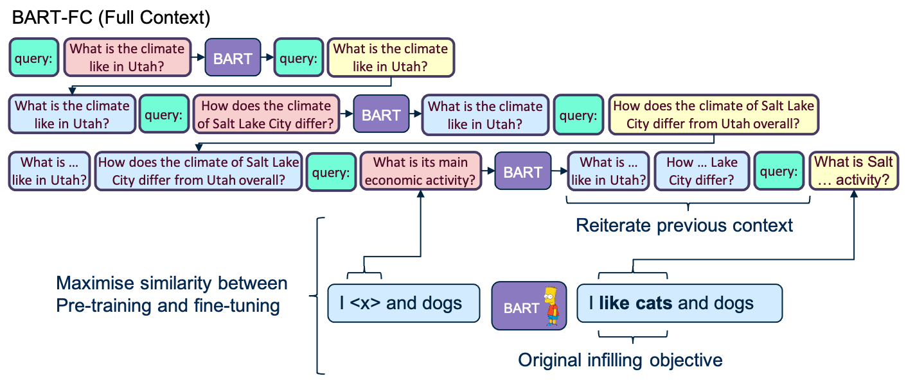
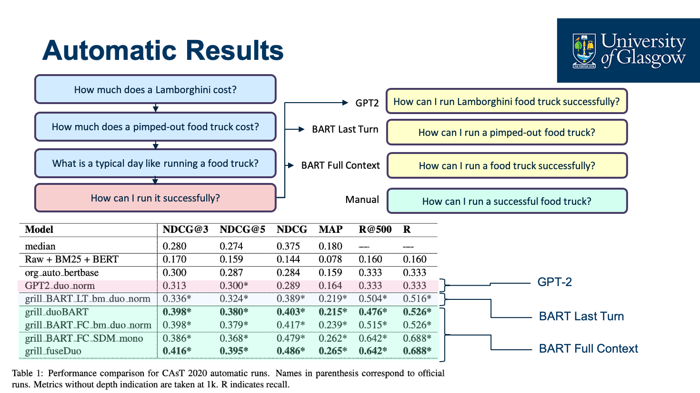

# Query Re-writing with BART-FC (Full Context)
By Carlos Gemmell (carlos.gemmell@glasgow.ac.uk | Twitter: @aquaktus) & Jeffrey Dalton (Jeff.Dalton@glasgow.ac.uk | Twitter: @JeffD)


BART-FC is a re-writer trained on only CAsT 2019. It takes an arbitrary amount of unresoved queries in a conversation and returns all turns fully resolved. BART-FC does this by rewriting each query individually and feeding the resolved query for the next turn. This ensures relevant entities are modeled effectively for each turn and not forgotten.

Limitations: BART-FC can suffer from cascading errors since an error early in the conversation can propagate through all later turns. 



```python
test_samples = [{'previous_queries':['How old are digital cameras?', 'Where were they invented?'],
                'unresolved_query':'Were they around the industrial era?'}]

eval_raw_samples = BART_conv_transform(test_samples)
resolved_query = eval_raw_samples[0]['full_rewritten_queries'][-1]

print("Output:", resolved_query)
>>> Output:  Were digital cameras around the industrial era?
```

When evaluated with a state-of-the-art retrieval pipeline (MonoBERT + DuoBERT) we achieve top scores in CAsT 2020.

